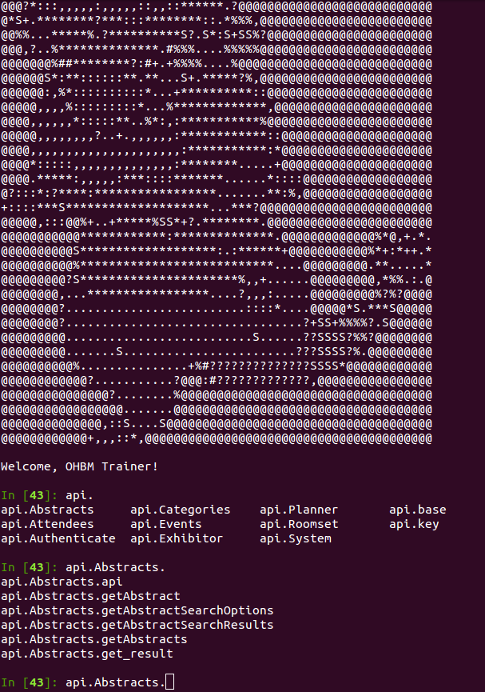

Getting Started
===============

This is a basic example to show firing up the API in Python, please post an issue if you would like others. Please be warned that none of these functions have been tested, so bugs are likely. To get them fixed, please `report an issue <https://github.com/vsoch/ohbm/issues>`_.

Authenticating the API
''''''''''''''''''''''

After you install the Python module, you can work with the API by way of the API object:

::

      #!/usr/bin/python

      from ohbm.api import Api

      access_token="XXXXXXXXXXXXXXXXXXXXXXXXXXXXX"
      api = Api(access_token)

Then each class of functions (eg, Abstracts or Events) can be viewed (with corresponding functions) from within that object:

Then, for example, to use one of those functions (get all abstracts) you might do the following:

:: 

      # Retrieve all abstracts
      abstracts = api.Abstracts.getAbstracts()

